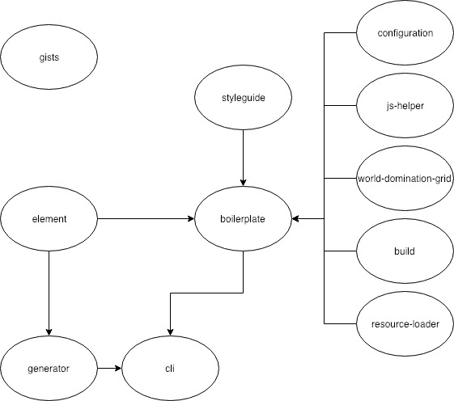
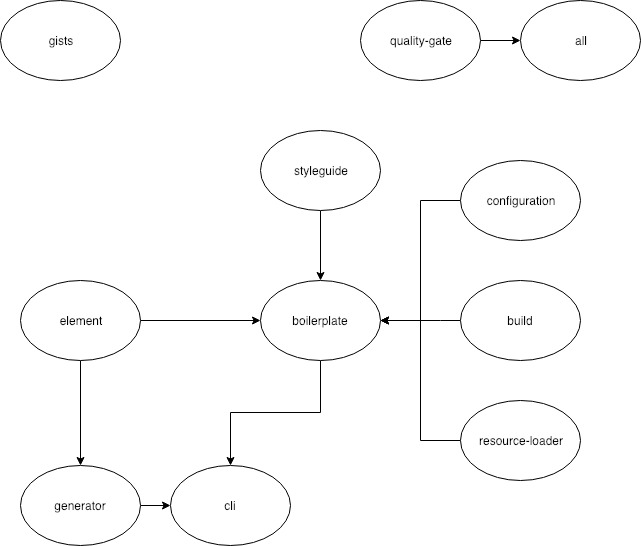

# Core Get-Together (11.01.2019)
## Participants
@jurekbarth @tiagomapmarques @timomayer @SheepFromHeaven

## Agenda:
1. Dependency chart
2. Clarify open questions
3. Roadmap for the next half a year (developer feedback)

## 1. Dependency chart
### Current architecture:

### Future architecture:

### Changes:
We will remove the grid and the js-helpers from biotope, a they are a dependency for the frontend project and not the component library.  
In addition the quality-gate, once finished, will be a dependency of all repositories, to make sure we keep the same code style everywhere.

## 2. Open questions
__Q__: bioto.pe: The domain is hard to tell people: Proposal to also buy biotope.sh  
__A__: we agree on making biotope.sh our new main page

__Q__: How do we handle other open source products that relate to biotope only loosely or not at all?  
__A__: We will create seperate organisations after consideration and link to vi organisation.  

__Q__: Who will take care of the branding (logo, social media)?  
__A__: We commited on a first step: @jurekbarth will take care of creation of logo and 2-3 color plus a font  

__Q__: When will we start working on biotope.sh?  
__A__: Now (with planning next steps in biweekly)

__Q__: Should we adress the release/versioning problem (package-lock.json file)  
__A__: Yes. We add it to the roadmap

__Q__: Should we keep major.minor.patch version definition or move to same versions in all repos?  
__A__: We will keep major.minor.path, it's too hard to keep versions same.

__Q__: Where does biotope register scripts?   
__A__: on the global `window.biotope` namespace. We will ad a biotope typescript interface.

__Q__: Can we remove the biotope- in front of the repos?  
__A__: We will keep it for now. @tiagomapmarques will researchif there is any reason for it.
 
## 3. Roadmap
 We created a roadmap for the next half a year. With 2 month iterations. Have a look here:  https://github.com/orgs/biotope/projects/2

## Review
We want to keep the in depth discussions.  
We do not want to do such a big planning again.
